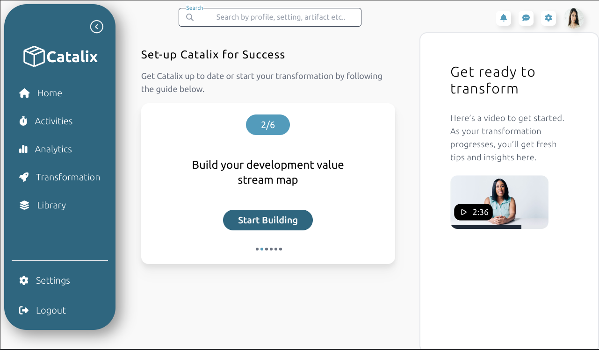
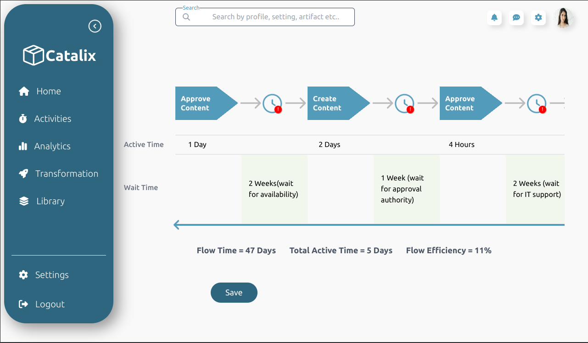
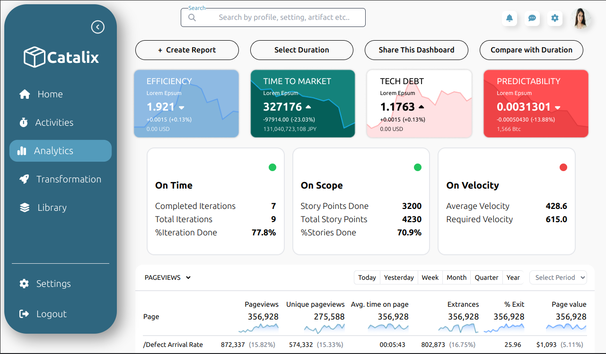

# Frontend Developer React Intern Assignment

Welcome to the repository for my assignment as a frontend developer React intern! This project showcases my skills in building responsive web applications using React.js for fast development.
## Live Demo
Link - https://catalix.vercel.app/

## Technologies Used
- React.js
- Tailwind CSS

## Screenshots

## Installation
To run this project locally, follow these steps:

1. Clone the repository to your local machine.
2. Navigate to the project directory.
3. Install dependencies by running `npm install`.
4. Start the development server by running `npm run dev`.
5. Open your browser and navigate to `http://localhost:3000`.

